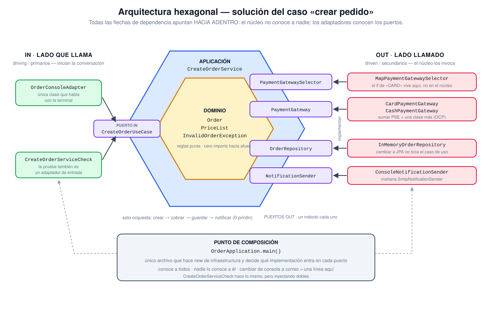

# Solución — Arquitectura hexagonal + SOLID

Migración de [`../hexagonal-architecture`](../hexagonal-architecture/README.md). El flujo observable es idéntico al del proyecto inicial; lo que cambió es quién sabe qué.

## Diagrama



## Estructura

```text
src/
├── OrderApplication.java          # punto de composición (único que ve implementaciones)
├── domain/                        # Order, PriceList, InvalidOrderException
├── application/                   # CreateOrderService (el caso de uso)
├── ports/
│   ├── in/                        # CreateOrderUseCase, CreateOrderCommand
│   └── out/                       # OrderRepository, PaymentGateway,
│                                  # PaymentGatewaySelector, NotificationSender
└── adapters/
    ├── in/console/                # OrderConsoleAdapter (única clase con System.out del flujo)
    └── out/                       # memoria, tarjeta, efectivo, notificación
test/
└── CreateOrderServiceCheck.java   # caso de uso probado con dobles, sin consola
```

## Ejecutar

Windows (PowerShell):

```powershell
$sourceFiles = Get-ChildItem src,test -Recurse -Filter *.java | ForEach-Object FullName
javac --release 17 -encoding UTF-8 -d out $sourceFiles
java -cp out OrderApplication
java -cp out -ea CreateOrderServiceCheck
```

Linux / macOS:

```bash
find src test -type f -name '*.java' -print0 | xargs -0 javac --release 17 -encoding UTF-8 -d out
java -cp out OrderApplication
java -cp out -ea CreateOrderServiceCheck
```

Salida esperada de la aplicación (igual a la del proyecto inicial):

```text
Cobro con tarjeta aprobado por $160000.0
Pedido guardado en memoria.
EMAIL -> Compra confirmada para ana@riwi.io
Pedido creado: Pedido=Curso SOLID | cantidad=2 | total=160000.0
```

## Qué resuelve cada principio

| Principio | Antes | Ahora |
|---|---|---|
| **SRP** | `OrderService` validaba, cobraba, guardaba, notificaba e imprimía | Cada responsabilidad vive en una clase: dominio valida y calcula, adaptadores hacen E/S, el caso de uso solo orquesta |
| **OCP** | `if ("CARD".equals(paymentType))` dentro de la lógica | Un `PaymentGateway` por medio de pago; agregar PSE es una clase nueva más un registro en `OrderApplication` |
| **LSP** | — | Cualquier `PaymentGateway`, `OrderRepository` o `NotificationSender` es intercambiable: el caso de uso no distingue cuál recibió |
| **ISP** | Un servicio que lo sabía todo | Puertos de un solo método, con lo que el núcleo realmente necesita |
| **DIP** | Dependía de `System.out` y de una `List` concreta | Depende de puertos; las implementaciones se inyectan por constructor desde el punto de composición |

## Criterios de éxito de la actividad

- **Probable sin `Scanner`/`System.out`/almacenamiento concreto** → `test/CreateOrderServiceCheck.java` ejercita el caso de uso con dobles en memoria.
- **Cambiar consola por correo no toca la lógica** → basta con otra implementación de `NotificationSender` y una línea distinta en `OrderApplication`.
- **Flujo observable conservado** → misma salida, verificada contra el proyecto inicial.
- **Adaptadores contra puertos pequeños** → cuatro puertos de salida, un método cada uno.
- **Composición en un punto de entrada** → `OrderApplication`; el caso de uso no construye nada.

## Detalle: por qué existe `PaymentGatewaySelector`

Traducir `"CARD"` a una pasarela es una decisión de configuración, no de negocio. El puerto mantiene ese `if` fuera del núcleo: `MapPaymentGatewaySelector` resuelve contra un mapa registrado en el punto de composición y cae al medio por defecto ante un tipo desconocido, igual que el código original.

## Qué hay en cada carpeta

| Carpeta | Qué contiene | Regla de dependencia |
|---|---|---|
| `domain/` | El negocio: `Order`, `PriceList`, `InvalidOrderException`. Qué es un pedido válido y cuánto cuesta. | No importa **nada** del resto del proyecto. Es el centro del hexágono. |
| `application/` | `CreateOrderService`: el caso de uso. Decide el orden de los pasos y nada más. | Importa `domain` y `ports`. Nunca `adapters`. |
| `ports/in/` | El contrato de **lo que la app sabe hacer**: `CreateOrderUseCase`, `CreateOrderCommand`. | Lo declara el núcleo; lo consumen los adaptadores de entrada. |
| `ports/out/` | El contrato de **lo que la app necesita del mundo**: repositorio, pago, selector de pago, notificación. | Lo declara el núcleo; lo implementan los adaptadores de salida. |
| `adapters/in/console/` | `OrderConsoleAdapter`: traduce terminal → comando y resultado → texto. | Importa `ports.in`. El núcleo no lo conoce. |
| `adapters/out/` | Memoria, tarjeta, efectivo, selector por mapa, notificación por consola. | Implementan `ports.out`. El núcleo no los conoce. |
| `OrderApplication.java` | Punto de composición: el único `new` de infraestructura. | Conoce a todos; nadie lo conoce a él. |
| `test/` | `CreateOrderServiceCheck`: el caso de uso con dobles. | Es, en la práctica, otro adaptador de entrada. |

## Por qué `in` y `out`

La dirección **no** la marca si el dato entra o sale, ni si aparece la consola. La marca **quién inicia la llamada**:

- **`in` (primarios, *driving*)** — alguien de afuera llama a la aplicación. La consola le pide crear un pedido. El adaptador de entrada **usa** el puerto; el puerto es una **interfaz que el núcleo implementa**.
- **`out` (secundarios, *driven*)** — la aplicación llama a alguien de afuera porque necesita algo: guardar, cobrar, notificar. El puerto es una **interfaz que el núcleo declara y el adaptador implementa**.

Regla práctica para clasificar un puerto: *¿quién implementa la interfaz?*

```text
IN   OrderConsoleAdapter ──llama──▶ CreateOrderUseCase ◀──implementa── CreateOrderService (núcleo)
OUT  CreateOrderService  ──llama──▶ NotificationSender ◀──implementa── ConsoleNotificationSender (adaptador)
```

Detalle que confunde: `ConsoleNotificationSender` escribe en la terminal y aun así es **out**. El medio coincide con el de la consola, pero ahí el núcleo llama hacia afuera. Y `CreateOrderServiceCheck` es **in**, aunque sea una prueba: es quien inicia la conversación.

Esa asimetría es toda la razón de ser de la arquitectura hexagonal: en ambos lados el núcleo depende solo de interfaces que él mismo define, así que las flechas de dependencia apuntan siempre hacia adentro, sin importar hacia dónde fluyen los datos.
